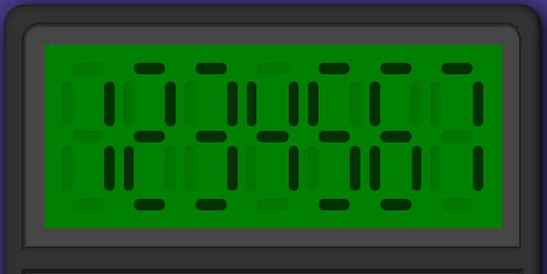

# odin-calculator

## description

Another project: a calculator. _May get abandoned a little, I want to start a project with somebody_. This time i'm making a simple calculator. Nothing fancy, nothing special, just another practice.

Maybe you noticed how the buttons aren't properly aligned. That's because I'm still using `flexbox` for everything. I know `grid` would be a better solution, but I don't want to use it until i learn about it in The Odin Project.

# Live:
## https://hectorvilas.github.io/odin-calculator/

***

## update 1
Added the LCD display thingy using `
`s for a classic calculator look. 10 vectorial images would be a lot less work and faster to manipulate, but where is the challenge on it?

The client would be mad if they heard how I wasted time on it, but there's no client on this project, so I'll just have fun.

I copied and pasted the digit code as placeholder, just to see how it looks before making it appear using Javascript.

The original idea is to append a `div` with the digit design for every single digit, and make the digit's stick change color like in a regular calculator. We will see how it plays out.

This is how it looks for now:

