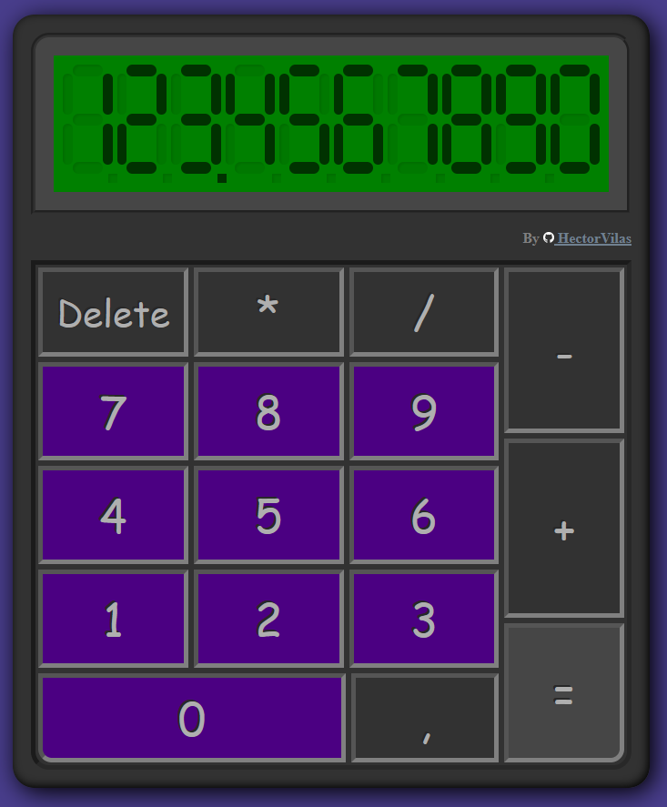

# odin-calculator

## description

Another project: a calculator. This time i'm making a ~~simple~~ calculator. ~~Nothing fancy, nothing special, just another practice.~~
***
Update: this calc got fancy! A display made of `divs` that turn on the little sticks to draw the digits, some calculator logic (you don't need to press "=" every single time, just click on another operator!), partial keyboard support... The crazy part is how I managed to draw everything with `divs`+`flexbox`, there's no images on this calculator, except for the Github logo.
***
Maybe you noticed how the buttons aren't properly aligned. That's because I'm still using `flexbox` for everything. I know `grid` would be a better solution, but I don't want to use it until I learn about it in The Odin Project.

# Live:
# https://hectorvilas.github.io/odin-calculator/


## update 1
Added the LCD display thingy using `<div>`s for a classic calculator look. 10 vectorial images would be a lot less work and faster to manipulate, but where is the challenge on it?

The client would be mad if they heard how I wasted time on it, but there's no client on this project, so I'll just have fun.

I copied and pasted the digit code as placeholder, just to see how it looks before making it appear using Javascript.

The original idea is to append a `div` with the digit design for every single digit, and make the digit's stick change color like in a regular calculator. We will see how it plays out.

This is how it looks for now:


## update 2
Now you can use the numbers on the page or in your keyboard to write on screen, but only text. The fancy LCD style will be disabled for now.
The buttons have a `hover` property so you can see what you are about to click.

## update 3
It was hard, but now the "calculator logic" is working! The equal button does nothing until it have two operands and an operator (just multiplication for now). You can also get a result pressing the operator again, get the result and store it as the first operator, so you can write the second one and keep calculating without the need of writing again everything.

I also added an event listener to show on console the two operands and the operator on every single click, so it made debugging a lot easier. Something was off, but thanks to Firefox's debugging tools I managed to discover why "2 x 2 = 8" using breakpoints.

The next step is to add function to the rest of the buttons, trying to no repeat myself. Also the actual code is a bit of a mess, needs some cleaning. The display is still a placeholder, the last step on this project will be making it functional.

## update 4
Wow! I just replaced a lot of repeated lines of code with some JS generation! Check it out!

This is the HTML code, it was repeated 10 times:
```html
<div class="digit">
    <div class="digit left">
        <div class="stick horizontal"></div>
        <div class="stick horizontal"></div>
    </div>
    <div class="digit center">
        <div class="stick vertical"></div>
        <div class="stick vertical"></div>
        <div class="stick vertical"></div>
    </div>
    <div class="digit right">
        <div class="stick horizontal active"></div>
        <div class="stick horizontal active"></div>
    </div>
</div>
```

And I just replaced that disaster with this generator:

```javascript
let digits = document.createElement("div");
digits.className = "digits";

for(let i = 0; i < 10; i++){
    let digit = document.createElement("div");
    digit.className = "digit";
    let digitLeft = document.createElement("div");
    digitLeft.className = "digit left";
    for (let i = 0; i < 2; i++) {
        let stickHorizontal = document.createElement("div");
        stickHorizontal.className = "stick horizontal";
        digitLeft.appendChild(stickHorizontal);
    }
    let digitCenter = document.createElement("div");
    digitCenter.className = "digit center";
    for (let i = 0; i < 3; i++) {
        let stickVertical = document.createElement("div");
        stickVertical.className = "stick vertical";
        digitCenter.appendChild(stickVertical);
    }
    let digitRight = document.createElement("div");
    digitRight.className = "digit right";
    for (let i = 0; i < 2; i++) {
        let stickHorizontal = document.createElement("div");
        stickHorizontal.className = "stick horizontal";
        digitRight.appendChild(stickHorizontal);
    }
    digit.appendChild(digitLeft);
    digit.appendChild(digitCenter);
    digit.appendChild(digitRight);
    digits.appendChild(digit);
}

lcd.appendChild(digits);
```
Maybe it's not big deal for real programmers, but I can't believe I managed to do it! Now the next step: do the same with the commas (update: done).

You probably already noticed that this calculator have a max of 10 digits. It was never meant to be precise, it's just me flexing my new knowledge.

## update 5
I just shrinked (optimized?) the code, replacing the repetition with a `querySelectorAll()`. All my number buttons had the class _number_ and the number itself in the ID (also used it for the comma), and took advantage of it. 20 lines of code got replaced with a single one:

```javascript
const btnNumbers = document.querySelectorAll(".number");
btnNumbers.forEach(btn => {
	btn.addEventListener("click", () => drawScreen(`${btn.id[1]}`));
});
```

Then I noticed I can use custom data attributes and get it's value with `getAttribute()`, so I took advantage of it for the operators:

```javascript
const btnOperators = document.querySelectorAll(".operator");
btnOperators.forEach(op => {
	op.addEventListener("click", () => ready(op.getAttribute("data-operator")));
});
```
I could combine those two in a single one if I also combine the `drawScreen()` and `ready()` functions, but won't save too much lines of code and would be harder to read.

## update 6
Now it's possible to write on the fancy numbers! Not from the page, anyways. With the new function `writeDigit(digit, value);` I can target one of the ten numbers and change it's sticks to an "active" state. I stored on a `switch-case` how to show all the numbers, telling whitch sticks have to be active. You can test it from the console using this function.

The next step is to show the `numbersOnScreen` variable (which stores the number being written as an array) in fancy numbers. Then find a way to make the commas get active in the right position.

## update 7
Now the fancy numbers are working like normal, instead of showing plain text. The commas are not showing for now, I need another method for those, to activate the little squares at the bottom. I'm not sure how I'm going to find the exact position. Maybe multiplying the number and then comparing with the original as _int_. The display will stop working, showing an "E" on screen after 10 digits (9 for negative numbers), but you can still see the numbers on console.

## update 8
I added more key functions. Now it's possible to add, substract, multiply or divide using the keyboard (numpad recommended).

As a little extra, now it's possible to change the operator if there's no two operands present, like in a real calculator.

Also a minimal technical change: the debug shows every time a button or key is pressed, there's no need to click somewhere to see those values anymore.

This project is almost ready. The final steps are: adding commas on screen and limit the digits after it.

## update 9

After going up and down in the code, I noticed how absurdly big a function was, something like 90-100 lines of code. For example, this is how I draw an "8" on screen:
```javascript
s1.classList.add("active");
s2.classList.add("active");
s3.classList.add("active");
s4.classList.add("active");
s5.classList.add("active");
s6.classList.add("active");
s7.classList.add("active");
```

Similar for the rest of the numbers. So I found a way to make it more simple, in a single line, saving like 50 lines of code in the function:

```javascript
[s1,s2,s3,s4,s5,s6,s7].forEach(s => s.classList.add("active"));
```
I just came with the idea, and it worked! I'm pretty sure any programmer know about it, but I think I never saw it done before in any tutorial I watched. Maybe the programming finally made a "click" in my head, again.

## update 10
Now the comma will be drawn on the fancy screen depending on it's position! Same limitation with the numbers: only have 10 possible positions.



***

# final toughts
So this is it! I finally finished the calculator. Nobody asked for a fancy screen, but I want to challenge myself! After all, this is suposed to be an exercise. I learned a lot more and I'm happy I can keep going like this without feeling blocked or lost in the course.

I want to clarify again that _this calculator is not precise with big numbers_. It only have a maximum of 10 digits on screen, and it's made like this by design. If you really needed those numbers, check the navigator's console (F12 on Firefox and Chrome, then look for the "console" tab).

I could consider the project finished, but there's still some things I could do with it. Maybe more fancy digits, or add some `.preventDefault()` in some places, or more functional keys... but I want to move on, keep learning, I want to be a real programmer someday!

See you in the next project!

***

# post-v1.0 updates

## update 1:
I can't leave the project unfinished, so I went back to it to make some necessary updates.

The number of commas has been limited to just one.

All the necessary keys now work on the calculator, with `.preventDefault()` to disable the default actions on the navigator, like the "/" key on the numpad that opens the "quick find" on Firefox, or the "Enter" key that would press again the last clicked button.

And finally, I modified the comments' format for consistency.